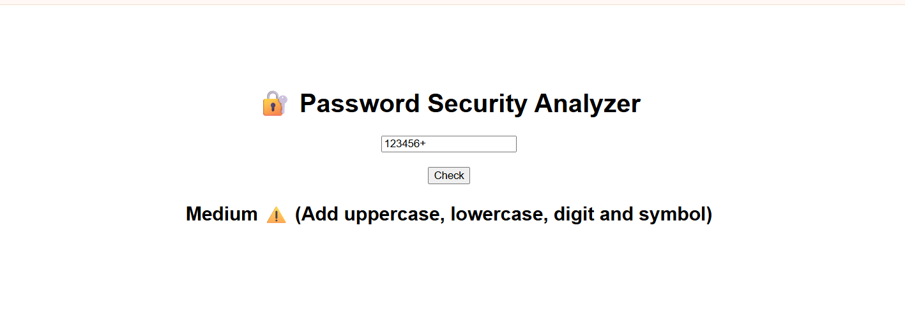

# 🔐 Password Security Analyzer

A simple web application built with FastAPI that checks password strength and provides basic security feedback.

## 🌐 Live Demo
https://password-security-analyzer-pxvd.onrender.com/

## 📸 Screenshot




## 🚀 Features
- Checks password strength
- Detects uppercase, lowercase, numbers and symbols
- Evaluates password length
- Identifies common passwords
- Displays simple feedback (Weak / Medium / Strong)

## 🛠 Tech Stack
- Python (basic level)
- FastAPI (beginner usage)
- HTML (simple template)
- Jinja2
- Uvicorn

## 📂 Project Structure
```text
password-security-analyzer/
├── main.py
├── checker.py
├── common.txt
├── requirements.txt
└── templates/
    └── index.html
